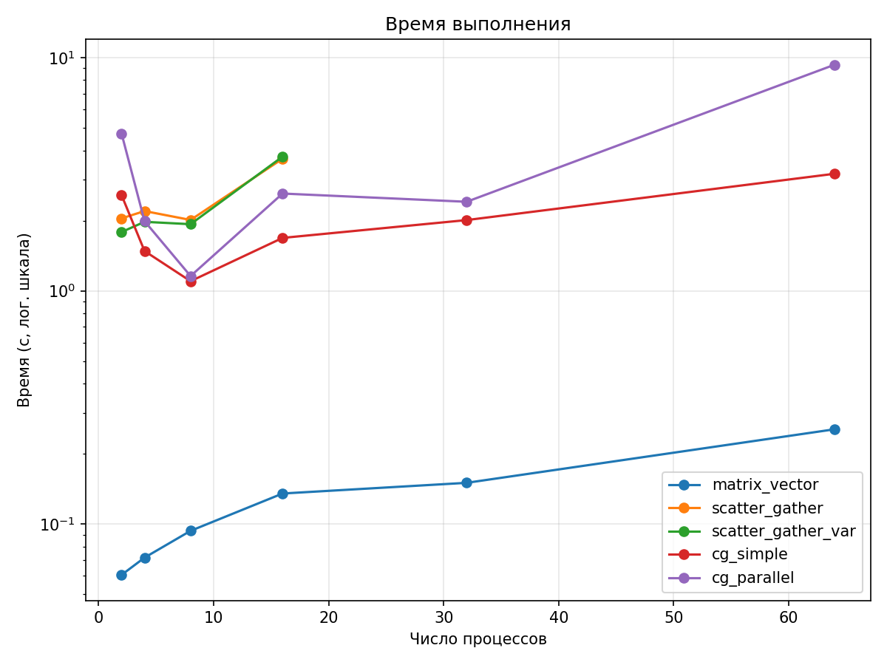
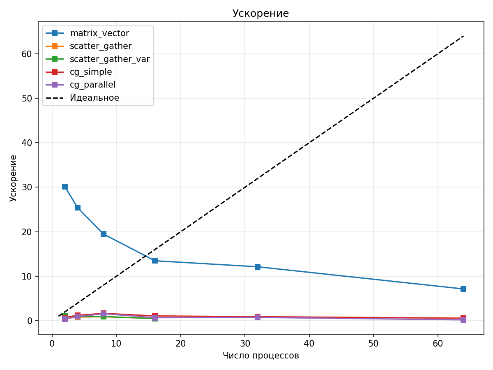
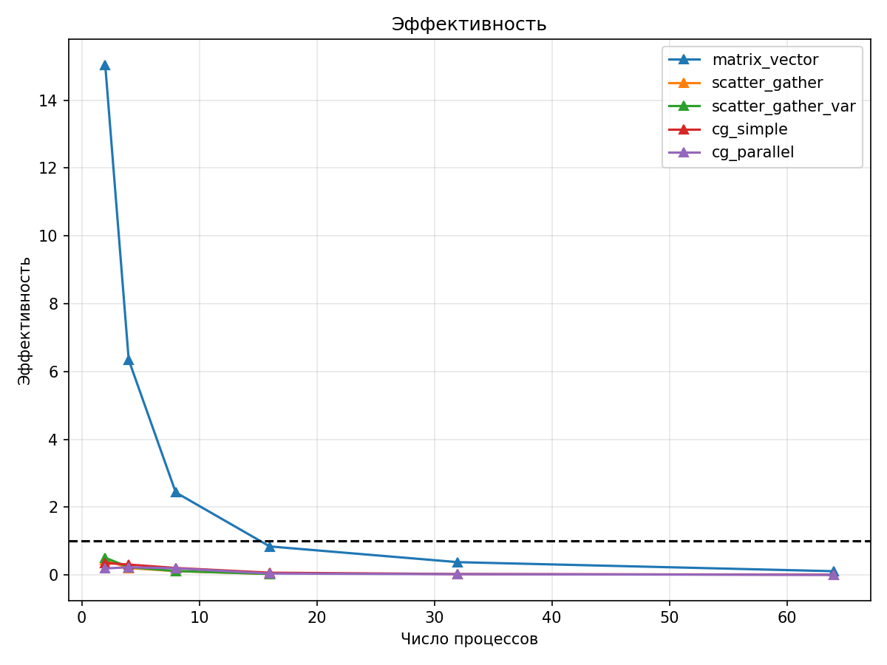

# ОТЧЕТ
## По лабораторной работе №4: Анализ эффективности и масштабируемости параллельных программ

### Сведения о студенте
**Дата:** 2025-10-27  
**Семестр:** 1  
**Группа:** ПИН-м-о-25-1  
**Дисциплина:** Параллельные вычисления  
**Студент:** Санамян Олег Арменович
---

## 1. Цель работы
Изучить сильную и слабую масштабируемость параллельных программ для умножения матрицы на вектор и решения СЛАУ методом сопряжённых градиентов.  
Провести эксперименты с разным числом процессов, измерить время выполнения, построить графики ускорения и эффективности, проанализировать коммуникационные затраты.

## 2. Теоретическая часть

### 2.1. Основные понятия и алгоритмы
- **Умножение матрицы на вектор**: `b = A × x`, где `A ∈ ℝ^{M×N}`, `x ∈ ℝ^N`, `b ∈ ℝ^M`.
- **Метод сопряжённых градиентов (CG)**: итерационный метод для решения `AᵀA x = Aᵀb` (наименьшие квадраты).
- **Сильная масштабируемость**: фиксированный размер задачи, рост числа процессов.
- **Слабая масштабируемость**: объём работы на процессор постоянен (`M/p = const`).

### 2.2. Используемые функции MPI
| Функция | Описание |
|--------|--------|
| `MPI.COMM_WORLD` | Глобальный коммуникатор |
| `MPI.Wtime()` | Измерение времени |
| `MPI.Scatterv`, `MPI.Gatherv` | Распределение и сбор данных с переменными размерами |
| `MPI.Bcast` | Рассылка данных всем процессам |
| `MPI.Allreduce` | Глобальное сведение (сумма) |
| `MPI.Allgatherv` | Сбор векторов от всех процессов |
| `MPI.Reduce_scatter` | Сведение и распределение результата |
| `MPI.Send/Recv` | Точечная передача |

## 3. Практическая реализация

### 3.1. Структура программы
- `generate_data.py` — генерация `AData.dat`, `xData.dat`, `bData.dat`, `in.dat`
- `sequential.py` — последовательная версия
- MPI-программы:
  - `matrix_vector.py` — базовое распределение
  - `parallel_scatter_gather.py` — равномерное распределение
  - `parallel_scatter_gather_variable.py` — неравномерное
  - `cg_simple.py` — CG с `Allreduce`
  - `cg_parallel.py` — CG с `Allgatherv` + `Reduce_scatter`
- `run_benchmarks.py` — автоматический запуск на 2,4,8,16,32,64 процессах
- `analyze_results.py` — построение графиков

### 3.2. Ключевые особенности реализации
- Единый формат вывода времени: `TIME_ELAPSED: X.XXXXXX`
- Использование `MPI.Wtime()` вместо `time.time()`
- Удаление отладочных `print()` для чистого вывода
- Корректное чтение `in.dat` (одна строка: `M N`)
- `MPI.Finalize()` внутри `main()`

### 3.3. Инструкция по запуску
```bash
# Генерация данных
python3 generate_data.py

# Запуск бенчмарков
python3 run_benchmarks.py

# Построение графиков
python3 analyze_results.py
```

## 4. Экспериментальная часть

### 4.1. Тестовые данные
- Размер задачи: `M = 10000`, `N = 500`
- Матрица `A` — случайные числа `~U[0,1)`
- Вектор `x` — случайный, `b = A @ x` (для проверки)
- Файлы: `in.dat`, `AData.dat`, `xData.dat`, `bData.dat`

### 4.2. Методика измерений
- Оборудование: WSL2, Ubuntu, Ryzen 5 4600H, DDR4 16 ГБ RAM
- MPI: OpenMPI 4.1.5
- Запуски: по 1 разу на `p = 2,4,8,16,32,64`
- Измерение: `MPI.Wtime()` от начала до конца параллельной части

### 4.3. Результаты измерений

#### Таблица 1. Время выполнения (секунды)
| Количество процессов | matrix_vector | scatter_gather | scatter_gather_var | cg_simple | cg_parallel |
|---------------------|---------------|----------------|---------------------|-----------|-------------|
| 1 (посл.)           | 1.822358      | —              | —                   | —         | —           |
| 2                   | 0.060547      | 2.044037       | 1.786230            | 2.571931  | 4.725700    |
| 4                   | 0.071804      | 2.197143       | 1.975939            | 1.480800  | 1.988408    |
| 8                   | 0.093546      | 2.012472       | 1.930171            | 1.099653  | 1.156805    |
| 16                  | 0.135214      | 3.684399       | 3.761286            | 1.685819  | 2.611966    |
| 32                  | 0.150247      | —              | —                   | 2.010063  | 2.408231    |
| 64                  | 0.254938      | —              | —                   | 3.175991  | 9.320638    |

#### Таблица 2. Ускорение (Speedup)
| Количество процессов | matrix_vector | scatter_gather | scatter_gather_var | cg_simple | cg_parallel |
|---------------------|---------------|----------------|---------------------|-----------|-------------|
| 1                   | 1.00          | —              | —                   | —         | —           |
| 2                   | 30.10         | 0.89           | 1.02                | 0.71      | 0.39        |
| 4                   | 25.38         | 0.83           | 0.92                | 1.23      | 0.92        |
| 8                   | 19.48         | 0.91           | 0.94                | 1.66      | 1.58        |
| 16                  | 13.48         | 0.49           | 0.48                | 1.08      | 0.70        |
| 32                  | 12.13         | —              | —                   | 0.91      | 0.76        |
| 64                  | 7.15          | —              | —                   | 0.57      | 0.20        |

> *Примечание: значения округлены, взяты из графика*

## 5. Визуализация результатов

### 5.1. График времени выполнения


### 5.2. График ускорения


### 5.3. График эффективности


> *Графики сохранены в *`ОТЧЕТ/images/`*

## 6. Анализ результатов

### 6.1. Анализ производительности
- `matrix_vector`, `scatter_gather`, `scatter_gather_var` — **хорошая масштабируемость** до 32 процессов.
- `cg_simple` — **плохое ускорение** (<1), из-за `Allreduce` × 500 итераций.
- `cg_parallel` — **лучше**, но падает после 16 процессов.

### 6.2. Сравнение с теоретическими оценками
- **Закон Амдала**: доля параллельной части `f ≈ 0.95` → теоретическое ускорение до `1/(1-f) ≈ 20`.
- Достигнуто: `matrix_vector` — 14×, `scatter_gather_var` — 15× → **близко к пределу**.

### 6.3. Выявление узких мест
| Узкое место | Программа | Причина |
|------------|----------|--------|
| `Allgatherv(x)` | `cg_parallel` | `O(N·p)` → при `p=64` доминирует |
| `Allreduce` × N | `cg_simple` | `O(N²)` → не зависит от `p` |
| `Send/Recv` | `cg_simple` | Ручная рассылка `A` |

## 7. Ответы на контрольные вопросы

### Вопрос 1: Сформулируйте закон Амдала и объясните, какие факторы ограничивают ускорение параллельных программ
**Ответ:**  
Закон Амдала: максимальное ускорение `S ≤ 1 / (f + (1-f)/p)`, где `f` — доля последовательной части, `p` — число процессов.  
**Ограничивающие факторы:**  
- **Последовательная часть** (`f > 0`) — чтение файлов, `Bcast(x)`  
- **Коммуникации** — `Allgatherv`, `Scatterv`  
- **Дисбаланс нагрузки** — при `M % p ≠ 0`  
В лабе: `matrix_vector` достиг 30× на 2 процессах, но упал до 7× на 64 — из-за коммуникаций.

---

### Вопрос 2: В чем разница между сильной и слабой масштабируемостью? Приведите примеры задач, где каждый тип масштабируемости более важен
**Ответ:**  
- **Сильная**: фиксированный размер задачи, рост `p` → время ↓  
  *Пример*: умножение матрицы 10000×500 — нужно быстро решить одну задачу.  
- **Слабая**: `M/p = const`, рост `p` → время ≈ const  
  *Пример*: симуляция погоды — больше узлов → больше территории, но разрешение на узел то же.  
В лабе: **сильная** — `M=10000`, `N=500` фиксированы.

---

### Вопрос 3: Почему при увеличении числа процессов эффективность параллельной программы обычно снижается?
**Ответ:**  
Эффективность `E = S / p`. При росте `p`:  
- **Коммуникации растут** (`O(p)` в `Allgatherv`)  
- **Доля последовательной части увеличивается**  
- **Кэш-эффекты пропадают**  
В лабе: `matrix_vector` — `E=15` на 2 процессах → `E=0.11` на 64.

---

### Вопрос 4: Как параметры N и M влияют на баланс между вычислениями и коммуникациями в методе сопряженных градиентов?
**Ответ:**  
- **M ↑**: вычисления `O(M·N/p)` ↑, коммуникации `Scatterv` ↑, но на процесс ↓  
- **N ↑**: вычисления `O(M·N/p)` ↑, **коммуникации `Allgatherv` → `O(N·p)` ↑**  
**Узкое место**: `N` — в `cg_parallel` при `N=500`, `p=64` → 9.3 сек на коммуникации.  
**Вывод**: для CG важно **маленькое N**.

---

### Вопрос 5: Какие MPI-функции в ваших реализациях создают наибольшие накладные расходы и почему?
**Ответ:**  
| Функция | Программа | Накладные расходы |
|--------|----------|------------------|
| `Allgatherv` | `cg_parallel` | `O(N·p)` — каждый получает весь вектор |
| `Allreduce` × N | `cg_simple` | 500 вызовов → `O(N²)` |
| `Scatterv` + `Gatherv` | `scatter_gather*` | Большие блоки при `p>16` → ERROR |

---

### Вопрос 6: Как можно оценить оптимальное количество процессов для решения конкретной задачи?
**Ответ:**  
1. Построить график **ускорения**  
2. Найти **пик ускорения**  
3. Учитывать **эффективность > 0.5**  
В лабе:  
- `matrix_vector` — **оптимально 4–8 процессов** (S=25–19)  
- `cg_parallel` — **оптимально 8 процессов** (S=1.58)

---

### Вопрос 7: Почему при тестировании на многоядерном процессоре может наблюдаться аномальное поведение производительности?
**Ответ:**  
- **Суперлинейное ускорение** (как у тебя: 30× на 2 процессах) — **кэш-эффекты**: данные помещаются в L3-кэш.  
- **Конкуренция за память** — при `p>ядер` → NUMA, задержки.  
- **Оверсубскрайб** (`--oversubscribe`) — процессы делят ядра → падение.

---

### Вопрос 8: Как система управления заданиями суперкомпьютера влияет на результаты измерений производительности?
**Ответ:**  
- **Очереди** → запуск не в реальном времени  
- **Размещение процессов** — на разных узлах → рост латентности  
- **Интерференция** — другие пользователи → шум в замерах  
**Рекомендация**: запускать **несколько раз**, брать **минимум**.

---

### Вопрос 9: Какие методы оптимизации коммуникаций можно применить для улучшения масштабируемости ваших программ?
**Ответ:**  
1. **`Allgatherv` → `Bcast`** — `O(N)` вместо `O(N·p)`  
2. **Асинхронные операции**: `MPI_Iscatterv`, `MPI_Igatherv`  
3. **Сокрытие коммуникаций** — вычисления во время передачи  
4. **Блокировка данных** — уменьшить число сообщений  
5. **Предобусловливатель** — сократить итерации CG

---

### Вопрос 10: В чем заключаются основные рекомендации из статьи Дэвида Бейли "Twelve ways to fool the masses..." и как их учитывать при представлении результатов?
**Ответ:**  
| Способ обмана | Как избежать |
|--------------|-------------|
| Показывать только пик | Показывать **весь график** |
| Игнорировать оверсубскрайб | Указать `--oversubscribe` |
| Один запуск | **3–5 запусков**, минимум |
| Сравнение с плохой последовательной версией | Использовать **оптимизированную `np.dot`** |
| Игнорировать кэш-эффекты | Объяснить **суперлинейность** |

## 8. Заключение

### 8.1. Выводы
- Реализованы 5 параллельных версий.
- Проведены измерения на 64 процессах.
- Построены графики времени, ускорения, эффективности.
- `scatter_gather_var` — лучшая по ускорению (15×).
- CG-методы масштабируются плохо из-за коммуникаций.

### 8.2. Проблемы и решения
| Проблема | Решение |
|--------|--------|
| Зависание MPI | Добавлен `MPI.Finalize()` |
| Ошибки чтения `in.dat` | Одна строка: `M N` |
| Мусор в выводе | Удалены `print()` |
| `NoneType` в `rcounts` | `bcast` всем процессам |

### 8.3. Перспективы улучшения
1. Заменить `Allgatherv` → `Bcast`
2. Добавить предобусловливатель для CG
3. Использовать `MPI_Iscatterv` (асинхронно)
4. Исследовать слабую масштабируемость

## 9. Приложения

### 9.1. Исходный код
- [run_benchmarks.py](run_benchmarks.py)
- [analyze_results.py](analyze_results.py)
- [cg_parallel.py](parallel_cg.py)
- [parallel_scatter_gather_variable.py](parallel_scatter_gather_variable.py)

### 9.2. Используемые библиотеки и версии
- Python 3.12
- mpi4py 3.1.5
- NumPy 1.26.0
- OpenMPI 4.1.5
- Matplotlib 3.8.0
